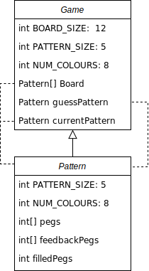
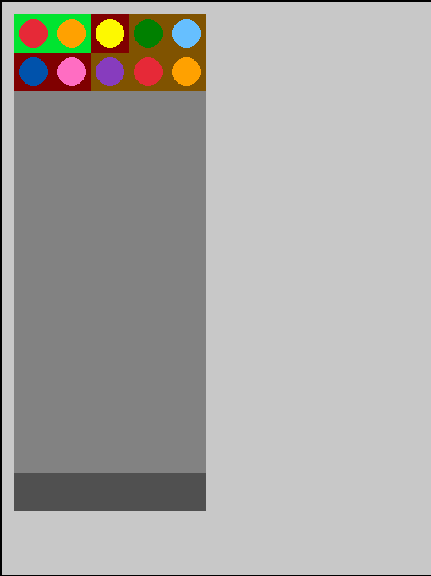
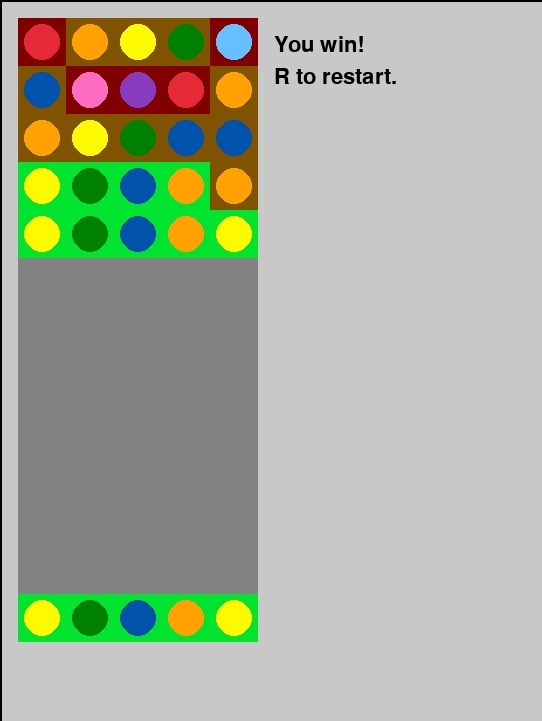
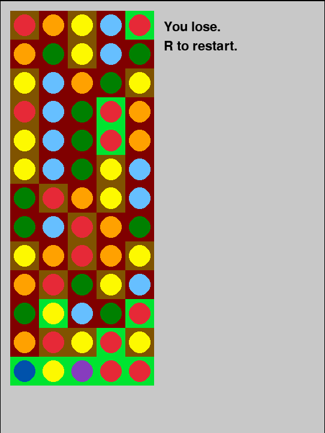

# Mastermind

An implementation of the game Mastermind in C++.

# Overview
## Class diagram

## Flowchart

# Requirements

* Raylib (currently v4.5)
* Linux-based OS (although the project can be easily ported to Windows)

# Build

Use `make` command

# Screenshots

Gameplay

Win condition

Lose condition

